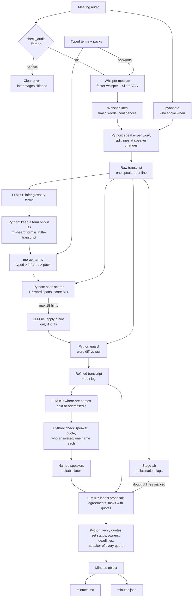
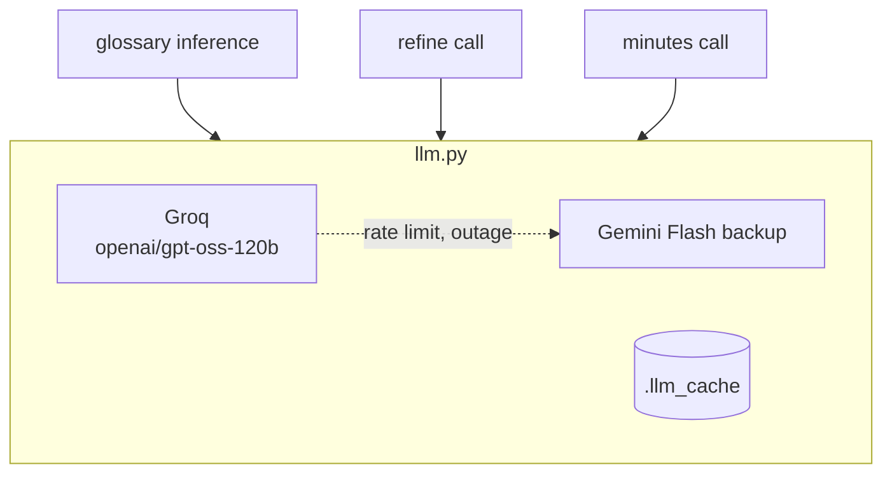

<p align="center">
  <picture>
    <source media="(prefers-color-scheme: dark)" srcset="docs/assets/interiit15-light.png">
    
  </picture>
  &nbsp;&nbsp;&nbsp;&nbsp;
  
</p>

<h1 align="center">Meeting Assistant</h1>

<p align="center">
  Recording → raw transcript → refined transcript → meeting record<br>
  <b>Team Zero Loss</b>: Sumedha Bhattacharya, Sahaj, Vitika Madhwani<br>
  Inter IIT Tech Meet 15.0 Bootcamp, ML problem statement (Phase 2)
</p>

---

An AI meeting assistant that turns a recorded meeting into an accurate, speaker-labelled transcript and a usable written record. It runs these models in a fixed order:

| Stage | Model | Role |
|---|---|---|
| 1. Speech to text | **Whisper medium** (OpenAI weights) run with **faster-whisper** (CTranslate2), Silero VAD | Transcribes the uploaded recording into timed lines with a confidence score for every word |
| 1a. Who spoke when | **pyannote** `speaker-diarization-community-1` | Separates the voices; every word gets the speaker talking at that moment, so every line has one speaker |
| 2. Transcript refinement | **LLM #1**: `openai/gpt-oss-120b` on Groq (Gemini Flash as backup) | Corrects misheard domain terms (names, products, acronyms, jargon) using the meeting context |
| 2b. Speaker names | **LLM #1** (same model) | Points at introductions ("I'm Priya") and people being addressed ("Priya, what do you think?"); Python checks each claim before a speaker gets a name. Names stay editable |
| 3. Meeting documentation | **LLM #2**: `openai/gpt-oss-120b` on Groq (Gemini Flash as backup), strict JSON schema | Writes the summary, minutes, decisions, action items and open questions from the refined transcript |

The rule that runs through the whole design: **models make the judgment calls, plain Python checks their work at every hand-off.** Nothing a model produces reaches the record without a deterministic check behind it.

---

## Contents

1. [How to host](#1-how-to-host)
2. [Using the app](#2-using-the-app)
3. [How the problem statement is covered](#3-how-the-problem-statement-is-covered)
4. [Architecture](#4-architecture)
5. [Stage 1: speech to text](#5-stage-1-speech-to-text)
6. [Stage 1b: hallucination flags](#6-stage-1b-hallucination-flags)
7. [Stage 1a and 2b: speakers and their names](#7-stage-1a-and-2b-speakers-and-their-names)
8. [Stage 2: domain-term refinement](#8-stage-2-domain-term-refinement)
9. [Stage 3: minutes, decisions and action items](#9-stage-3-minutes-decisions-and-action-items)
10. [The LLM layer](#10-the-llm-layer)
11. [Orchestration, failures and saved runs](#11-orchestration-failures-and-saved-runs)
12. [The interface](#12-the-interface)
13. [Outputs](#13-outputs)
14. [Configuration](#14-configuration)
15. [Repository layout](#15-repository-layout)
16. [Tests](#16-tests)
17. [Running stages on their own](#17-running-stages-on-their-own)
18. [Design decisions and references](#18-design-decisions-and-references)
19. [Known limitations](#19-known-limitations)
20. [Troubleshooting](#20-troubleshooting)

---

## 1. How to host

Everything below takes a fresh machine to a running app, end to end.

### 1.1 What you need

| Requirement | Why | Notes |
|---|---|---|
| **Python 3.11 or newer** | the code uses modern type syntax | `python3 --version` |
| **ffmpeg** (includes `ffprobe`) | every upload is checked with `ffprobe` before Whisper runs; Whisper decodes audio through it | Ubuntu/WSL: `sudo apt install ffmpeg` ; macOS: `brew install ffmpeg` |
| **A Groq API key** (free) | LLM #1 and LLM #2 | create one at [console.groq.com](https://console.groq.com), no card needed |
| A Hugging Face token (optional, free) | speaker diarization | create a "read" token at [huggingface.co/settings/tokens](https://huggingface.co/settings/tokens) and accept the conditions of [pyannote/speaker-diarization-community-1](https://huggingface.co/pyannote/speaker-diarization-community-1) once; without it the app runs without speakers |
| A Gemini API key (optional) | backup provider when Groq is rate limited or down | [aistudio.google.com](https://aistudio.google.com) |
| An NVIDIA GPU (optional) | fast transcription | without one, Whisper runs on the CPU (int8), which works but is several times slower |
| Disk space | Whisper medium is ~1.5 GB, downloaded once on first run; the CUDA libraries are ~1 GB on Linux | |
| Internet | first run downloads Whisper; every run calls the LLM provider | |

Tested on Ubuntu under WSL2 with an RTX 4050 (6 GB). On that machine a 17.5-minute meeting goes through the whole app in about a minute.

### 1.2 Install

```bash
# 1. system dependency
sudo apt update && sudo apt install -y ffmpeg

# 2. get the code
git clone https://github.com/sumedhabhattacharya0711-spec/ML-bootcamp.git
cd ML-bootcamp

# 3. a virtual environment keeps the packages separate from your system Python
python3 -m venv .venv
source .venv/bin/activate          # Windows PowerShell: .venv\Scripts\Activate.ps1

# 4. Python packages (faster-whisper, gradio, openai, pydantic, rapidfuzz, ...)
pip install --upgrade pip
pip install -r requirements.txt    # on a slow connection: pip install --default-timeout=600 -r requirements.txt

# 5. install this project itself, so `meeting_assistant` can be imported from anywhere
pip install -e .
```

> **WSL users:** keep the project inside the Linux file system (`~/...`), not under `/mnt/c`, which is much slower. For the GPU, install only the normal Windows NVIDIA driver; check that `nvidia-smi` works inside WSL. The CUDA libraries Whisper needs (`nvidia-cublas-cu12`, `nvidia-cudnn-cu12`) come from `requirements.txt`, and `stt.py` loads them itself.

### 1.3 Add your API key

```bash
cp .env.example .env
```

Open `.env` and set at least:

```ini
LLM_API_KEY=gsk_your_groq_key_here
```

For speaker labels, also set `HF_TOKEN=hf_your_token_here`.

Optional lines in the same file: `LLM_GEMINI_KEY` for the backup provider, `LLM_MODEL` / `LLM_BASE_URL` to point at another OpenAI-compatible provider, `LLM_CACHE=0` to switch off the answer cache. The full list is in [section 14](#14-configuration). `.env` is git-ignored; never commit it.

Check the key works:

```bash
python -m meeting_assistant.llm            # sends a tiny test message and prints the reply
```

### 1.4 Run

```bash
python app.py
```

The first start downloads Whisper medium (about 1.5 GB) and loads it into memory. When the terminal prints

```
* Running on local URL:  http://127.0.0.1:7860
```

open **http://127.0.0.1:7860** in a browser, upload a recording, and press **Run**.

### 1.5 Hosting options

`app.py` takes a few flags:

| Command | Who can open the app |
|---|---|
| `python app.py` | only this computer, at `http://127.0.0.1:7860` |
| `python app.py --host 0.0.0.0` | any device on the same network, at `http://<this computer's IP>:7860` |
| `python app.py --share` | anyone with the link: Gradio also prints a temporary public `https://….gradio.live` address (valid for about 72 hours) while this computer keeps doing the work |
| `python app.py --port 8000` | same as the first, on another port |
| `python app.py --no-diarize` | same as the first, without loading the speaker model |
| `python app.py --model-size turbo` | start with another Whisper size (`small`, `medium`, `turbo`, `large-v3`); the size can also be changed in the app |

For a permanent public deployment, the same `app.py` runs on any machine or service that can run Python with ffmpeg (for example a Hugging Face Space): install as above and set `LLM_API_KEY` as a secret environment variable. On CPU-only hardware choose the `small` Whisper size, since `medium` is slow without a GPU.

### 1.6 Check the installation

```bash
pytest -m "not slow"        # 149 fast tests with a fake Whisper, a fake diarizer and a fake LLM, a few seconds
pytest                      # also runs the one slow test with real Whisper
```

---

## 2. Using the app

1. **Upload** a meeting recording (`.wav .mp3 .m4a .flac .ogg .webm .mp4`).
2. Optionally type **glossary terms**: names, products, jargon, separated by commas, semicolons or new lines (`Kubeflow, ONNX, Priya`). They are sent to Whisper and used for correction.
3. Optionally tick a **preset word pack** (`ml_tech`). Only useful when the pack matches the meeting's topic.
4. Choose the **Whisper size**. Each option states its speed, memory and accuracy trade-off.
5. Leave **Identify speakers** on, optionally give the **number of speakers** (0 = find out) and the **attendees'** names (`Priya Sharma, Rahul`). Attendee names are spelled right by Whisper and used to match the names heard.
6. Press **Run**. The status table fills in stage by stage.
7. Inspect the results in the tabs and download the files. In the **Speakers** tab, edit any name and press **Apply names**.

| Tab | What it shows |
|---|---|
| Meeting record | summary, minutes, decisions (agreed / open / rejected), action items (owner and deadline, or "unspecified"), open questions, each with timestamped evidence quotes; what the checks removed and why; the faithfulness report |
| Speakers | one row per voice: name (editable), how the name was found, confidence, talk time; the conversation with one colour per speaker. **Apply names** renames everywhere and rewrites the saved files, without running any model again |
| Transcripts | raw and refined transcripts side by side, each line with its speaker. Raw marks low-confidence words and possible hallucinations; refined marks every applied edit |
| Details | every segment with Whisper's confidence values and hallucination score, the edit log (applied and blocked, with reasons), the hints sent to LLM #1 with their scores, possible errors the LLM flagged but did not change, the final glossary with each term's source, every speaker-name claim with the check's verdict, and every LLM call with tokens and time |
| Files | all saved files for this run and `run.json` |

---

## 3. How the problem statement is covered

| Requirement from the PS | Where it is handled |
|---|---|
| Speech-to-text model transcribes the recording | Stage 1, `stt.py` |
| A language model corrects domain-specific terms, preserving names, numbers, negation and commitments | Stage 2, `glossary.py` + `refine.py`, with a guard that reverts edits to numbers and negations |
| A **separate** language model produces minutes, decisions and action items | Stage 3, `minutes.py`, a different call with a different prompt and a strict schema |
| The two LLM roles are distinct stages, run in order in one workflow | `pipeline.py` runs Stage 1 → 1b → 2 → 3 |
| Raw and refined transcripts retained and shown separately | Transcripts tab; `transcript_raw.txt` and `transcript_refined.txt` in every run |
| Owners and deadlines only when stated, otherwise "unspecified" | Stage 3: Python sets them from verified quotes only; "I'll do it" names its speaker as owner |
| Speaker labels (optional in the brief) | Stage 1a diarization, Stage 2b names from the transcript, editable in the Speakers tab |
| A proposal is never presented as an agreed decision | Stage 3: status is set by Python, "agreed" only with a verified agreement quote |
| Unsupported, empty or unreadable files get a clear error | `stt.check_audio()`, shown in the status table |
| Clear processing or failure status | per-stage status table: waiting, running, done, failed, skipped, with time and message |
| Human-readable and machine-readable record with the same content | `minutes.md` and `minutes.json`, both rendered from one pydantic object |
| Download of the outputs | Files tab |
| No prewritten or hardcoded outputs | every output comes from the pipeline run on the uploaded audio |
| Models and their roles identified | the table at the top of this README, and the app header |
| Prompts included | `prompts/` |

---

## 4. Architecture

### 4.1 Data flow



### 4.2 Who does what

| Step | Done by | Why it is not the other one |
|---|---|---|
| Rejecting bad files | Python (`ffprobe`) | must be exact and instant |
| Hearing the audio | Whisper | the only model that can |
| Telling voices apart | pyannote | needs a model of voices, not of words |
| Joining words and speakers, splitting lines | Python (time overlap) | exact and cheap; Whisper's word times are enough |
| Spotting where a name is said or addressed | LLM #1 | needs language understanding ("thanks, Rahul" vs "send it to Rahul") |
| Accepting a name for a speaker | Python | must be checkable: right speaker, real quote, the addressed person answered |
| Spotting phantom lines | Python score | LLMs detect Whisper hallucinations poorly without a reference transcript |
| Guessing which domain terms the meeting uses | LLM #1 | needs language understanding |
| Checking those guesses are grounded | Python | an LLM can invent terms; the transcript cannot |
| Finding spans that sound like a glossary term | Python (Metaphone + spelling) | deterministic, cheap, measurable |
| Deciding whether a term fits the context ("Laura from sales" vs "fine-tune with Laura") | LLM #1 | needs meaning, not sound |
| Allowing or reverting each edit | Python guard | the rules (numbers, negations) must never be skipped |
| Writing minutes and labelling evidence | LLM #2 | needs summarisation |
| Deciding agreed / open / rejected, owners, deadlines | Python | must follow fixed rules the LLM cannot override |

### 4.3 Shared services



All three LLM calls go through `llm.py`: one OpenAI-compatible client, retries, a backup provider and an answer cache.

---

## 5. Stage 1: speech to text

**Files:** `src/meeting_assistant/stt.py`

### 5.1 Input checks: `check_audio()`

Before Whisper sees anything, `ffprobe` inspects the file. Each problem has its own message, shown in the status table:

| Problem | Message |
|---|---|
| file is empty | "The file is empty." |
| extension not supported | "Unsupported format: … Use one of: .flac, .m4a, .mp3, .mp4, .ogg, .wav, .webm." |
| no audio stream (for example a video without sound) | "The file has no audio track." |
| `ffprobe` cannot read it | "The file is corrupt or unreadable as audio." |
| shorter than 1 second | "The recording is too short (… s)." |
| loudest moment quieter than −50 dB | "The recording appears to be silent." |

If Silero VAD then finds no speech at all, the stage reports that too.

### 5.2 Loading the model: `load_model()`

Whisper is loaded **once** when the app starts and kept in memory. With an NVIDIA GPU it loads in `float16`; `_preload_cuda_libs()` first loads cuBLAS and cuDNN from the pip packages inside the virtual environment, so no system CUDA install is needed. If the GPU is missing or out of memory, it falls back to the CPU in `int8` and says so in the terminal. Changing the size in the app swaps the model on the next run, freeing the old one first.

| Size | Parameters | Notes |
|---|---|---|
| small | 244M | fastest, noticeably more mistakes |
| **medium** (default) | 769M | the thresholds in this project were tuned on it |
| turbo | ~809M | large-v3 with a 4-layer decoder: fast, close to large-v3 accuracy |
| large-v3 | 1.55B | most accurate, slowest, may not fit in 6 GB |

### 5.3 The call

```python
raw_segments, info = model.transcribe(
    str(path),
    language="en",                     # the brief is English-only
    vad_filter=True,                   # Silero VAD skips silence, where Whisper invents text
    word_timestamps=True,              # per-word times and confidences
    hotwords=hotwords or None,         # typed and pack glossary terms
    condition_on_previous_text=False,  # one chunk's text can't loop into the next
    temperature=0.0,                   # no sampling fallback: same audio, same transcript
)
```

Why each argument is there:

- **`vad_filter=True`**: most Whisper hallucinations happen over silence and noise. Skipping silence removes the commonest cause.
- **`word_timestamps=True`**: every word gets a start, an end and a probability. Stage 2 uses the probability: a span containing a word Whisper was unsure of (probability below 0.5) gets a looser hint threshold. The UI shades those words.
- **`hotwords`**: the user's typed terms and pack terms bias Whisper towards the right spellings. `hotwords` is used instead of `initial_prompt` because, with `condition_on_previous_text=False`, `initial_prompt` only reaches the first 30-second window; `hotwords` reaches every window. The text is capped (50 terms / 600 characters, typed terms first) because Whisper keeps only part of its prompt, and too many terms can make it "hear" words nobody said.
- **`condition_on_previous_text=False`**: feeding each chunk's text into the next is the main cause of repetition loops.
- **`temperature=0.0`**: faster-whisper normally re-decodes hard chunks with random sampling. Before this setting the same meeting came out with anywhere from 130 to 178 lines; now the same audio and the same terms always give the same transcript.

### 5.4 Output

A `Transcript` with the full text, the language, the duration, timing and, per segment: start, end, text, `no_speech_prob`, `avg_logprob`, `compression_ratio`, and the words with their own times and probabilities. Numbers are converted to plain floats so they can be saved as JSON. The raw transcript shown in the app and sent to the LLMs is one line per segment:

```
[00:12.72] you know, not a hunk of metal. And user-friendly, grannies to kids, maybe
```

---

## 6. Stage 1b: hallucination flags

**Files:** `src/meeting_assistant/hallucination.py`, `data/hallucination/BoH.csv`

A *hallucination* is text Whisper writes that nobody said, usually over silence or noise: "Thanks for watching!", "Subtitles by the Amara.org community". It comes from YouTube subtitles in Whisper's training data. This is different from a *mishearing* (a real word transcribed wrongly), which Stage 2 handles.

### 6.1 Where the phrase list comes from

Barański et al. (ICASSP 2025) ran Whisper on about 301,000 clips with no speech in them (noise, music, silence). Anything it wrote was invented. They kept phrases that came up often and that an English language model finds unlikely, and published the **Bag of Hallucinations**: 294 phrases (`BoH.csv`, MIT licence, from [DSP-AGH/ICASSP2025_Whisper_Hallucination](https://github.com/DSP-AGH/ICASSP2025_Whisper_Hallucination)).

We add a few phrases from prompt 02 of [DSP-AGH/asr_hallucination_detection_prompts](https://github.com/DSP-AGH/asr_hallucination_detection_prompts), and remove phrases real people say in meetings ("mm hmm", "uh huh", "I know", "good morning", "excuse me", "hold on" …). Text is normalised the same way as the list (lowercase, non-alphanumerics to spaces), so "I'm sorry." matches "i m sorry".

### 6.2 The score

Every segment gets points:

| Points | Rule |
|---|---|
| +2 | contains a YouTube or subtitle phrase ("thanks for watching", "subtitles by" …) |
| +1 | the whole line is one of the phantom phrases |
| +1 | the same line repeats back to back |
| +1 | in the middle of the meeting (not the last 10%), and it is a phantom/subtitle phrase or an ordinary line repeated 3+ times |
| +1 | Whisper was unsure: `no_speech_prob` > 0.6 or `avg_logprob` < −1.0 |
| +1 | looping text: `compression_ratio` > 2.4 |

**A score of 2 or more flags the line.** Flagged lines are **never deleted**, because people really do say "thank you" and "bye". They are highlighted in the raw transcript with the reasons, and marked `[DOUBTFUL]` for LLM #2, which is told never to use them as evidence.

On the 17.5-minute AMI meeting ES2004a (run without hotwords), exactly one line of 178 was flagged: "Thanks for watching!" over the silence at the end.

---

## 7. Stage 1a and 2b: speakers and their names

**Files:** `src/meeting_assistant/speakers.py`, `prompts/speaker_names.txt`

Diarization answers "who spoke when?" with anonymous voices. Naming those voices is a separate step. Both stages are optional: without `HF_TOKEN` (or with `--no-diarize`) they are skipped and everything else runs as before.

### 7.1 Who spoke when (Stage 1a)

[pyannote](https://github.com/pyannote/pyannote-audio) `speaker-diarization-community-1` (pyannote.audio 4) finds the speaker turns. The audio is decoded once with the same ffmpeg path Whisper uses and handed over in memory. Its *exclusive* output (one speaker at any moment) is used, because a transcript line can only have one speaker. If you know the number of speakers, giving it helps the clustering.

Words and speakers are joined as in WhisperX ([Bain et al. 2023](https://arxiv.org/abs/2303.00747)): every Whisper word gets the speaker whose turn overlaps it most, or the nearest turn within 0.5 s. Whisper's lines often run across a change of speaker ("I propose we keep it. Yes, let's keep it."), so **a line is split where its speaker changes**, giving one speaker per line everywhere downstream. Two clean-up rules handle timing jitter (Whisper's word times can be 0.1 to 0.3 s off):

| Rule | Example |
|---|---|
| a change in the middle of a sentence moves to a sentence end at most 2 words away | "… keep it. Yes, ‖ let's keep it." becomes "… keep it. ‖ Yes, let's keep it." |
| a 1-word run that is not a whole sentence joins the run before it | "so we [S2: should] really go" stays one speaker; "Keep it. [S2: Yes.] Good." keeps the "Yes." |

Speakers are numbered by first appearance (Speaker 1 spoke first). A line where diarization heard nobody gets no speaker and **one extra hallucination point** ("no voice found by diarization"): Whisper invents text over silence, diarization does not.

### 7.2 Names (Stage 2b)

Same rule as the rest of the project: **the LLM proposes, Python verifies.** LLM #1 reads the refined transcript with speaker labels (`[12] S2: …`) and lists every place a name is revealed, with the line and the exact words. Python then checks each claim:

| Kind | Example | Accepted only if |
|---|---|---|
| `self` | S1: "Hi, I'm Priya" | the line really is S1's, the quote is really there, and it contains the name |
| `addressed` | S1: "Rahul, what do you think?" → S2 answers | the line is someone else's, and S2 either spoke just before it ("thanks, Rahul") or is the first to answer after it, skipping other people's "mm-hmm" |

Third-person mentions ("Priya said yesterday", "send it to Rahul") are not evidence, and words like "everyone" or "team" are not names. Lines flagged as possible hallucinations are ignored. A self-introduction counts 3 points, being addressed 1 point. Names are then handed out one to one, best first. A speaker whose two best names tie, or a name that fits two speakers equally well, stays unnamed with a note ("unclear: Priya or Rahul"). Confidence is "high" from 2 points (an introduction, or being addressed twice). A heard name is spelled like the closest attendee you typed ("pria" → "Priya Sharma").

Every claim and its verdict is shown in the Details tab and saved in `speakers.json`.

### 7.3 Editing names

Automatic names can be wrong, and a speaker nobody names stays "Speaker N". In the **Speakers** tab you can type any name and press **Apply names**. This renames the speaker in the transcripts, the meeting record (summary, minutes, owners, evidence) and the saved files, without running Whisper or any LLM again. Quotes stay word for word as spoken. Giving two speakers the same name merges them (useful when diarization split one person in two); clearing a name goes back to "Speaker N". `pipeline.rename_speakers(result, {"S2": "Rahul"})` does the same from Python.

### 7.4 What the record gains

With speakers known, Stage 3 sees `[i] Priya: …` and Python adds three rules:

- **Agreement must come from someone else:** the proposer's own "yes, let's do that" does not make a decision agreed (Fernández et al. 2008: a proposal plus agreement by others).
- **"I'll do it" names its speaker as owner:** if no owner is supported by a quote, the speaker of a verified first-person commitment ("I'll send it", "let me check") becomes the owner.
- **The owner must accept it:** when the owner is a known speaker, an action item is "agreed" only if the acceptance quote is the owner's own.

Every evidence quote carries its speaker (`[00:12.40] Rahul, agreement: "…"`), and the record lists the participants.

---

## 8. Stage 2: domain-term refinement

**Files:** `src/meeting_assistant/glossary.py`, `src/meeting_assistant/refine.py`, `prompts/glossary_infer.txt`, `prompts/refine_system.txt`, `data/glossary/*.txt`

The approach follows Pusateri et al. 2024, *Retrieval Augmented Correction of Named Entity Speech Recognition Errors* ([arXiv 2409.06062](https://arxiv.org/abs/2409.06062)): in their study a plain "fix this transcript" prompt made errors worse, while giving the LLM retrieved candidate terms as hints reduced them. **Python proposes, the LLM decides, Python verifies.**

### 8.1 Build the glossary

Three sources, in order of trust:

1. **Typed terms** from the app (most trusted).
2. **Inferred terms**: LLM #1 reads the raw transcript and lists the domain terms the meeting is about, each with the transcript words it was heard as (`{"term": "Kubeflow", "heard_as": "cube flow"}`). Python keeps a term **only if its `heard_as` words really appear in the transcript**, so the LLM cannot add made-up terms. Lines flagged as doubtful are left out of this call.
3. **Preset packs**: plain text files in `data/glossary/`, one term per line, `#` for comments.

`merge_terms()` de-duplicates ignoring case and keeps the most trusted spelling. If the inference call fails, the glossary still has the typed and pack terms, with a warning.

### 8.2 Find hints (pure Python)

For every line, every span of 1 to 5 words (never crossing a sentence end) is compared with every glossary term:

- **sound**: similarity of the Metaphone codes (via `jellyfish`)
- **spelling**: character similarity (via `rapidfuzz`)
- **score** = the average of the two, 0 to 100

A span becomes a hint when the score is **82 or more**, or **75 or more** if Whisper gave one of its words a probability below 0.5. Further filters:

- everyday words ("could", "mean", "point" …) are never hinted on their own
- single words shorter than 4 characters are skipped
- the spelling part must be at least 60
- a span that already contains the term's words is skipped
- best non-overlapping match per span, **at most 15 hints**

**Why 82:** at the original threshold of 72, the AMI meeting produced hints like "point" → Pound (80), "makes it" → Market (76), "functions" → Functional design (74.5 / 78.9), and LLM #1 sometimes accepted them. Every wrong hint we saw scored 80 or less; every real fix scored 83 or more (Laura → LoRA 83.3, tally text → Teletext 85.3, graph ana → Grafana 90, on x → ONNX 92.9, cube flow → Kubeflow 93.8). The cut-off was moved into the gap.

### 8.3 LLM #1 decides fit

If there are no hints, **no LLM call is made**. Otherwise LLM #1 gets the hinted lines (with their neighbours for context) and the hints, and returns only the lines it changed, plus "possible errors" it noticed without a hint. The prompt (`prompts/refine_system.txt`) tells it to apply a hint only when the term fits the meaning, change only the hinted words, and never touch numbers, dates, negations or commitments.

Example: "ask Laura from sales, then fine tune with laura at rank four". Both "Laura"s score 83.3 against LoRA, so Python hints both. LLM #1 keeps the person and changes the method.

### 8.4 The guard

Python compares each changed line with the raw line, word by word (`difflib`), and **reverts** any edit that:

| Rule | Example blocked |
|---|---|
| touches a number | "15th" → "16th" |
| touches a negation | "will not" → "will now" |
| deletes words | |
| changes words that were not hinted | "I mean," → "menu" (the hint was only "mean") |
| does not produce a glossary term (nearly exactly, score 90+) | "costs" → "cost" |

Every edit, applied or blocked, goes into the **edit log** with its reason. "Possible errors" from the LLM are kept only if their words really are in the line, and are **never applied**: they are shown as "possible error, not changed".

---

## 9. Stage 3: minutes, decisions and action items

**Files:** `src/meeting_assistant/minutes.py`, `src/meeting_assistant/segment.py`, `prompts/minutes_system.txt`

### 9.1 LLM #2 labels, it does not decide

Following Fernández et al. 2008, *Modelling and Detecting Decisions in Multi-party Dialogue* (SIGdial, [aclanthology.org/W08-0125](https://aclanthology.org/W08-0125/)), a decision is a proposal followed by explicit agreement. LLM #2 reads the refined transcript and returns a `MinutesDraft`:

```text
summary          3 to 6 sentences
minutes          main topics, one line each
decisions        text, proposal_quote, agreement_quotes[], rejection_quotes[]
action_items     task, task_quote, owner, owner_quote, deadline, deadline_quote, agreement_quote
open_questions   question, quote
```

It is called with the pydantic schema as the response format, so the provider constrains generation to valid JSON of exactly that shape. pydantic then validates it again.

### 9.2 Python verifies and sets every status

- **Quote check:** every quote is looked up in the transcript (`rapidfuzz.partial_ratio` ≥ 90) and mapped to its line and timestamp. An item whose main quote is not found is **dropped**. Doubtful lines never count as evidence.
- **Decision status:**
  - `agreed`: a verified agreement quote exists. A lone backchannel ("mm hmm", "yeah", "okay" …) does not count.
  - `rejected`: a verified rejection quote exists.
  - `open`: anything else. Open proposals are listed, never shown as decisions.
- **Owners and deadlines:** kept only if a verified quote supports them, otherwise `"unspecified"`.
- **Action-item status:** `agreed` (named owner plus a verified acceptance), `proposed` (owner named but nobody verifiably took it on), `unassigned` (no supported owner).
- **Evidence:** each item keeps all its verified quotes with role (proposal, agreement, rejection, task, owner, deadline), line number and start time.

Everything that was removed or downgraded is listed with the reason, and counted in a **faithfulness report** (decisions proposed / kept / agreed, action items proposed / kept / agreed, owners and deadlines removed, quotes ignored, evidence support rate, refinement edits applied and blocked).

### 9.3 Long meetings

Groq's free tier allows about 8K tokens per minute, so one call must fit the prompt, transcript and answer. A transcript longer than about 4,000 tokens is split into topic parts by `segment.py`, which uses lexical cohesion as in TextTiling (Hearst 1997): it compares the words just before and after each gap and cuts where the similarity dips. Each part gets one call (with a short note of earlier parts), and the drafts are merged, de-duplicating items that match (`token_set_ratio` ≥ 85). A 17-minute meeting fits in one call.

### 9.4 One object, two formats

The verified `Minutes` object is rendered twice: `minutes.md` for people and `minutes.json` for programs. The content is identical by construction, and a test checks it. Empty lists stay empty ("(none)"), as the brief requires.

---

## 10. The LLM layer

**File:** `src/meeting_assistant/llm.py`

| Feature | Detail |
|---|---|
| Providers | Groq (`openai/gpt-oss-120b`) as primary, Gemini Flash as backup, both through their OpenAI-compatible APIs with the `openai` client |
| Two entry points | `call_llm(system, user)` returns text (glossary, refine); `call_llm_structured(system, user, Model)` returns a validated pydantic object (minutes) |
| Fallback | on a rate limit, quota, timeout, outage or server error, the same request goes to Gemini (when `LLM_GEMINI_KEY` is set). A bad key, bad request or wrong model name does **not** fall back, so setup mistakes stay visible |
| Retries | up to 3, waiting as long as the provider asks |
| Settings | temperature 0, fixed seed, reasoning effort "low" for gpt-oss, 8,192 max output tokens; any setting a model rejects is dropped and remembered |
| Cut-off answers | if an answer stops at the token limit, it is retried once with double the limit; a half answer is never used |
| Cache | every answer is stored in `.llm_cache/` under a fingerprint of model + prompt + input, so re-running the same input gives exactly the same result. `LLM_CACHE=0` turns it off |
| Errors | every failure becomes one plain-English `LLMError` shown next to the stage that failed |
| Usage log | provider, model, tokens and seconds of every call, saved in `run.json` and shown in the app |

---

## 11. Orchestration, failures and saved runs

**File:** `src/meeting_assistant/pipeline.py`

`run(audio_path, model, glossary_text, packs, ...)` runs Stage 1 → 1b → 2 (glossary + refine) → 3 in order. Orchestration is plain sequential Python: the pipeline is linear, with no branching, tools or memory, so a framework would add dependencies without adding capability.

Each stage has a status (waiting, running, done, failed, skipped), a message and its time. A callback updates the app's status table as each stage starts and ends.

**A failure never wipes earlier work:**

| What fails | What happens |
|---|---|
| bad or empty audio, or an unknown pack | Stage 1 fails with the reason; later stages are skipped ("no transcript") |
| Stage 1a (diarization) | everything runs without speakers |
| Stage 2 (glossary or refine) | Stage 3 still runs, on the raw transcript |
| Stage 2b (names) | speakers stay "Speaker 1", "Speaker 2", … |
| Stage 3 | both transcripts are kept and saved |

**Every run, including failed ones, is saved** to `runs/<date-time>/`:

| File | Contents |
|---|---|
| `transcript_raw.txt` | Whisper's output; with speakers, one `[mm:ss.ss] Name: text` line per segment |
| `transcript_refined.txt` | after Stage 2 |
| `speakers.json` | speakers (name, how found, confidence, talk time), every name claim with its verdict, the speaker turns |
| `edit_log.json` | every edit, applied or blocked, with reasons; hints with scores |
| `minutes.md` | the readable record |
| `minutes.json` | the structured record |
| `run.json` | stage statuses, timings, settings, model names, glossary, flags, LLM usage, faithfulness report |

---

## 12. The interface

**File:** `app.py` (Gradio)

- A minimal light theme, one page: inputs at the top, Run, the status table, then four tabs.
- One Whisper model in memory at a time, behind a lock; runs are queued one at a time (one GPU).
- The pipeline runs in a worker thread and streams status updates into the table.
- When a run starts, old results are cleared, so nothing stale stays on screen.
- A header above the results records what this result came from: file, Whisper size and device, LLM, audio length, segments, hotwords, typed glossary, packs, and the run folder.

---

## 13. Outputs

For each recording the app displays and lets you download:

| Output | Contents |
|---|---|
| Raw transcript | the speech-to-text result before refinement |
| Refined transcript | after domain-term correction, with every edit logged |
| Meeting minutes | a concise summary and the main topics in order |
| Key decisions | each with status (agreed / open / rejected) and timestamped evidence; an empty list if none were reached |
| Action items | task, owner and deadline (or "unspecified"), status and evidence; an empty list if none |
| Open questions | issues the meeting explicitly left open |

`minutes.md` example:

```markdown
## Decisions
- **agreed**: Keep it
  - [00:02.00] proposal: "I propose we keep it"
  - [00:04.00] agreement: "Yes, let's keep it"

## Action items
- (none)
```

---

## 14. Configuration

All settings live in `.env` (copy `.env.example`):

| Variable | Default | Meaning |
|---|---|---|
| `LLM_API_KEY` | (required) | Groq API key |
| `LLM_BASE_URL` | Groq's OpenAI-compatible URL | any OpenAI-compatible endpoint |
| `LLM_MODEL` | `openai/gpt-oss-120b` | model for both LLM stages |
| `LLM_GEMINI_KEY` | (empty) | enables the Gemini backup |
| `LLM_GEMINI_MODEL` | Gemini Flash | backup model |
| `LLM_CACHE` | on | `0` disables the answer cache |
| `MINUTES_SEGMENT_TOKENS` | `4000` | transcript size above which Stage 3 splits by topic |
| `HF_TOKEN` | (empty) | Hugging Face token for speaker diarization; empty = no speakers |
| `DIARIZATION_MODEL` | `pyannote/speaker-diarization-community-1` | another pyannote pipeline, e.g. `pyannote/speaker-diarization-3.1` |

Thresholds are constants at the top of each module, each with a comment explaining its value:

| Module | Constant | Value |
|---|---|---|
| `stt.py` | `MIN_DURATION_S`, `SILENCE_MAX_DB` | 1.0 s, −50 dB |
| `hallucination.py` | `FLAG_SCORE`, `NO_SPEECH_PROB_MAX`, `AVG_LOGPROB_MIN`, `COMPRESSION_RATIO_MAX`, `END_FRACTION`, `MIN_PLAIN_REPEAT` | 2, 0.6, −1.0, 2.4, 10%, 3 |
| `refine.py` | `MATCH_SCORE`, `MATCH_SCORE_UNSURE`, `UNSURE_PROB`, `MAX_SPAN_WORDS`, `MAX_HINTS`, `GUARD_TERM_SCORE`, `MIN_SPAN_CHARS`, `MIN_SPELLING` | 82, 75, 0.5, 5, 15, 90, 4, 60 |
| `minutes.py` | `QUOTE_MIN_SCORE`, `SAME_ITEM_SCORE` | 90, 85 |
| `speakers.py` | `NEAREST_TURN_S`, `SNAP_WORDS`, `MIN_RUN_WORDS`, `REPLY_LINES`, `SELF_POINTS`, `ADDRESSED_POINTS`, `HIGH_CONFIDENCE` | 0.5 s, 2, 2, 4, 3, 1, 2 |

---

## 15. Repository layout

```
ML-bootcamp/
├── app.py                      Gradio interface (python app.py)
├── requirements.txt            Python dependencies
├── pyproject.toml              makes src/meeting_assistant installable (pip install -e .)
├── .env.example                settings template; copy to .env
├── prompts/
│   ├── glossary_infer.txt      LLM #1: infer the meeting's domain terms
│   ├── refine_system.txt       LLM #1: apply hints that fit
│   ├── speaker_names.txt       LLM #1: where speakers' names are revealed
│   └── minutes_system.txt      LLM #2: minutes, decisions, tasks with quotes
├── src/meeting_assistant/
│   ├── stt.py                  Stage 1: audio checks, Whisper
│   ├── hallucination.py        Stage 1b: phantom-line score
│   ├── glossary.py             Stage 2: typed / inferred / pack terms, Whisper hotwords
│   ├── refine.py               Stage 2: hint finder, LLM #1 call, guard
│   ├── minutes.py              Stage 3: LLM #2 call, quote checks, status rules, Markdown/JSON
│   ├── segment.py              Stage 3: topic splitting for long meetings
│   ├── speakers.py             Stage 1a/2b: diarization, speaker per line, names, renaming
│   ├── llm.py                  providers, fallback, retries, cache
│   ├── pipeline.py             runs the stages in order, saves runs
│   └── paths.py                project folders
├── data/
│   ├── glossary/ml_tech.txt    a preset word pack
│   └── hallucination/          BoH.csv and its licence
├── tests/                      pytest suite (fake Whisper and fake LLM)
├── docs/                       development notes, README images
└── runs/                       one folder per run (created automatically)
```

---

## 16. Tests

```bash
pytest -m "not slow"   # 149 tests, a few seconds, no GPU or API key needed
pytest                 # plus 1 slow test with real Whisper
```

The tests cover the deterministic parts with a fake Whisper and a fake LLM; LLM quality is not a unit-test question.

| File | What it protects |
|---|---|
| `test_stt.py` | empty, wrong-format, corrupt, no-audio, too-short and silent files give the right error |
| `test_hallucination.py` | "Thanks for watching!" is flagged; a single confident "Thank you." at the end is not; repeats and loops; normal lines pass |
| `test_glossary.py` | parsing typed terms, packs and comments, grounding of inferred terms, merge priority, graceful failure, the hotwords cap |
| `test_refine.py` | cube flow → Kubeflow is hinted; everyday words are not; weak hints below 82 are not sent; the guard blocks numbers, negations, unhinted words and non-glossary results |
| `test_minutes.py` | the proposer's own agreement does not count; "I'll do it" makes its speaker the owner; proposal + agreement = agreed; proposal alone or "mm hmm" = open; unverified quotes dropped; missing owners become unspecified; Markdown and JSON carry the same items |
| `test_speakers.py` | lines split where the speaker changes, jitter smoothing, every name check (self, addressed + answered, third person, invented quotes), one-to-one naming and ties, renaming |
| `test_segment.py` | long transcripts split at topic changes, within the size budget |
| `test_llm.py` | fallback to Gemini on rate limits, no fallback on a bad key, cut-off answers retried with a larger limit, rejected settings dropped |
| `test_pipeline.py` | speakers found, named and used in the record; renaming rewrites the files; diarization or naming failures carry on; a full run saves every file; bad audio skips later stages; a Stage 2 failure still writes minutes; a Stage 3 failure keeps both transcripts |

---

## 17. Running stages on their own

Every module can be run from the command line on a recording, which is useful for debugging one stage:

```bash
python -m meeting_assistant.stt            data/audio/meeting.wav
python -m meeting_assistant.hallucination  data/audio/meeting.wav
python -m meeting_assistant.refine         data/audio/meeting.wav --terms "Kubeflow, ONNX" --hints-only
python -m meeting_assistant.minutes        data/audio/meeting.wav
python -m meeting_assistant.speakers       data/audio/meeting.wav --speakers 4 --names
python -m meeting_assistant.pipeline       data/audio/meeting.wav --terms "Kubeflow, ONNX" --attendees "Priya, Rahul"
python -m meeting_assistant.llm --models   # lists the models your key can use
```

---

## 18. Design decisions and references

| Decision | Reason | Reference |
|---|---|---|
| Retrieve sound-alike hints, let the LLM decide fit, guard the result | plain LLM correction made errors worse; hints reduced them | Pusateri et al. 2024, [arXiv 2409.06062](https://arxiv.org/abs/2409.06062) |
| Metaphone + spelling average instead of a trained acoustic retriever | the paper's acoustic model is not public; the combination was checked on our own clips | (our adaptation) |
| A decision needs a proposal plus explicit agreement; status set in code | separates proposals from decisions, as the brief requires | Fernández et al. 2008, [aclanthology.org/W08-0125](https://aclanthology.org/W08-0125/) |
| `rejected` and `open` statuses | proposals without agreement must go somewhere other than "decisions" | our extension of Fernández et al. |
| Phantom-phrase list, flag but never delete | the most common Whisper hallucinations come from subtitles; real meetings contain "thank you" | Barański et al., ICASSP 2025, [code and list](https://github.com/DSP-AGH/ICASSP2025_Whisper_Hallucination) |
| VAD before Whisper | most hallucinations occur over silence | Barański et al. 2025; Koenecke et al., "Careless Whisper", FAccT 2024 |
| pyannote diarization, speaker per word, lines split at changes | the record needs "who": owners, agreement by others | Bredin 2023; Plaquet & Bredin 2023; WhisperX (Bain et al. 2023) |
| Names: LLM finds introductions and addresses, Python checks speaker, quote and reply | an LLM can read "thanks, Rahul"; only the turns can confirm who Rahul is | in the spirit of DiarizationLM (Wang et al. 2024): text fixes what voices cannot |
| Topic splitting for long meetings | keeps each call within the provider's token limit | Hearst 1997, TextTiling |
| Strict schema output plus pydantic | the shape is guaranteed, so a malformed answer cannot crash a run | |
| Temperature 0, fixed seed, answer cache, Whisper temperature 0 | the same input gives the same output, which makes results reproducible and debuggable | |
| Plain sequential orchestration | the pipeline is linear; a framework adds nothing here | |

---

## 19. Known limitations

- **Speaker labels are only as good as diarization.** pyannote reports about 18.8% DER on AMI headset-mix audio for its 3.1 pipeline (its own figure, not ours); similar voices, overlapping speech and very short turns are the hard cases. We have not measured DER on our own clips yet; AMI's speaker annotations would allow it.
- **A speaker nobody names stays "Speaker N"** until you type a name. Names come only from introductions and people being addressed, never from guesses about roles.
- **The speaker model needs a Hugging Face token**, adds PyTorch (~2-3 GB) to the install and uses up to ~1 GB of GPU memory next to Whisper.
- **The guard cannot stop a wrong edit that produces a real glossary term.** That is why weak hints are not sent at all (the 82 threshold).
- **Thresholds were tuned on one real meeting** (AMI ES2004a) plus synthetic test cases; they may need retuning for very different audio.
- **A term that is in no glossary source cannot be corrected.** It stays as Whisper heard it, which is the safe failure: a missed fix leaves the original word, a wrong fix changes meaning.
- **The first run on a new recording depends on the LLM's answer at that time**; re-runs are identical thanks to the cache.
- **Groq's free tier** limits tokens per minute; very long meetings are split into parts, and the Gemini backup takes over when Groq is rate limited.

---

## 20. Troubleshooting

| Symptom | Fix |
|---|---|
| `ModuleNotFoundError: No module named 'meeting_assistant'` | run `pip install -e .` inside the activated virtual environment |
| `ModuleNotFoundError: No module named 'openai'` (or another package) | activate the environment (`source .venv/bin/activate`) and run `pip install -r requirements.txt` |
| `ffprobe` / `ffmpeg` not found | install ffmpeg (`sudo apt install ffmpeg`) |
| "GPU load failed …; falling back to CPU" | check `nvidia-smi` works; make sure `nvidia-cublas-cu12` and `nvidia-cudnn-cu12` installed; or just use the CPU (slower) |
| `libcublas.so.12 is not found` | same as above: the CUDA pip packages are missing from the environment |
| Out of GPU memory | choose `small` or `medium` instead of `large-v3` |
| "LLM provider: key rejected" | check `LLM_API_KEY` in `.env` (one variable per line, no quotes needed) |
| "rate limited" in Stage 2 or 3 | wait a minute and run again, or add `LLM_GEMINI_KEY` for the backup |
| First run is slow | it is downloading Whisper (~1.5 GB); later starts load from the local cache |
| Stage 1a: "HF_TOKEN is not set" or "Could not load …" | set `HF_TOKEN` in `.env` and accept the model's conditions on its Hugging Face page with the same account |
| Speakers merged or split wrongly | enter the right **number of speakers** and run again, or give two speakers the same name to merge them |
| Port 7860 already in use | stop the other app, or run `python app.py --port 7861` |
| Same output every time even after changing a prompt | the cache keys include the prompt, so a changed prompt gets a fresh answer; to force fresh answers anyway, delete `.llm_cache/` or set `LLM_CACHE=0` |

---

<p align="center"><b>Team Zero Loss</b>, Inter IIT Tech Meet 15.0 Bootcamp, IIT Guwahati</p>
